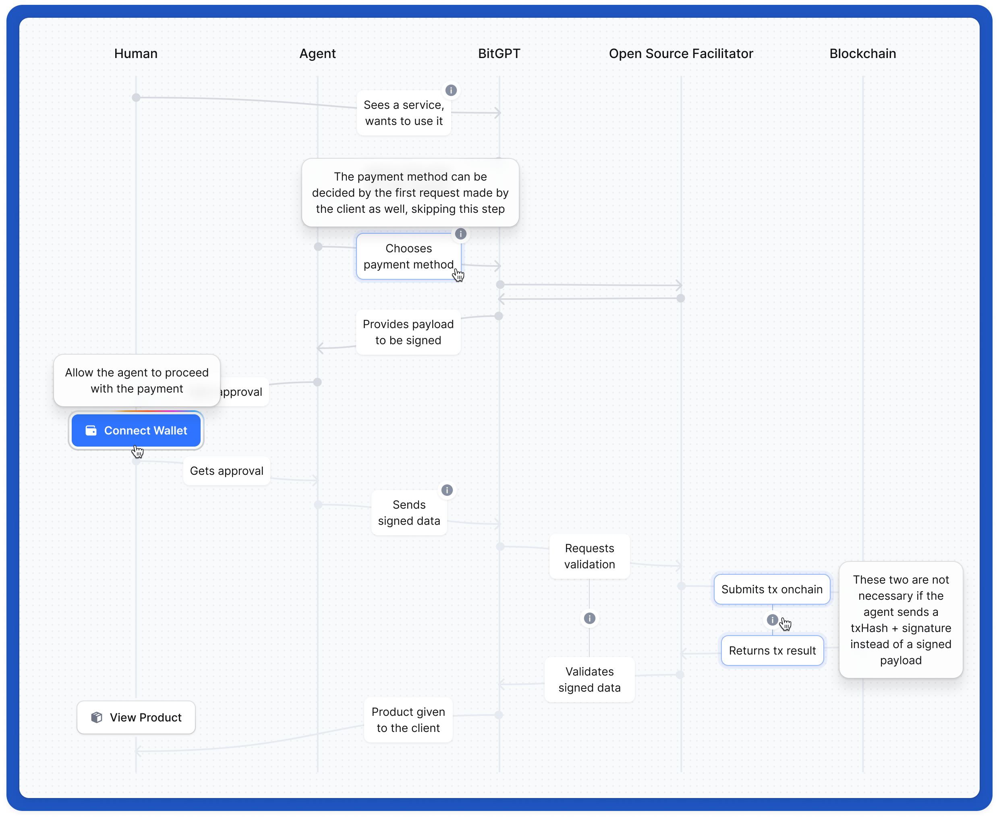
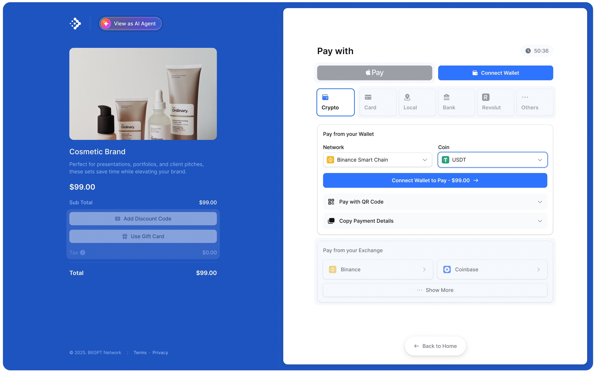
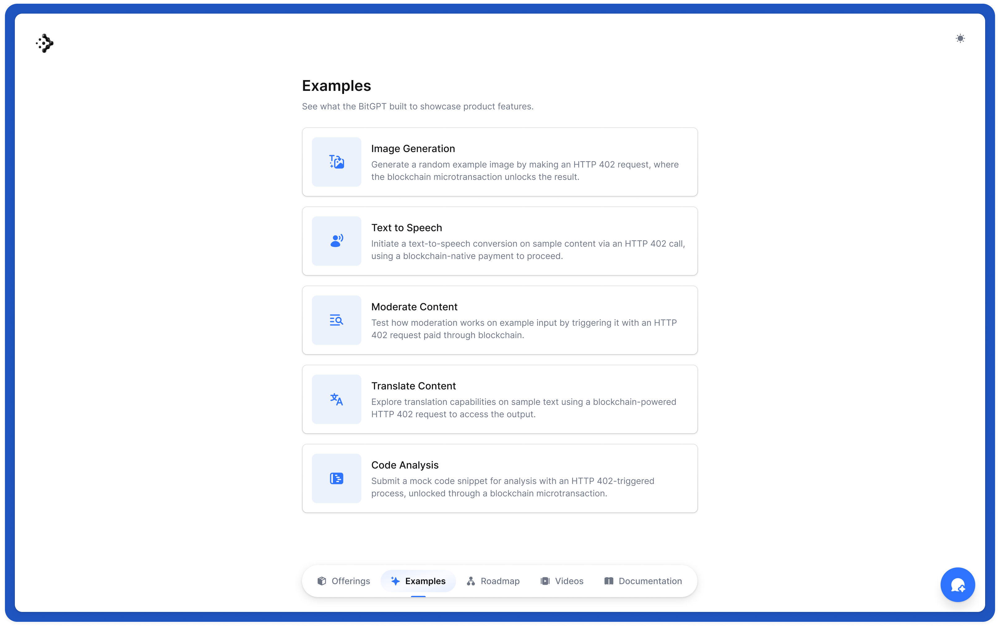

# HTTP 402 protocol

HTTP 402 is the web-native standard for payments. Our mission is to design a frictionless machine-to-machine protocol that allows agents to pay for APIs, compute resources, and data using simple HTTP requests and native blockchain transactions scaling to billions of sub-cent microtransactions.

This unlocks a previously unattainable economic layer for AI-native commerce, while simultaneously delivering a best-in-class user experience for humans.

We've released [402pay](https://402pay.com) powered by the HTTP 402 protocol to showcase what is possible.

```js

// This is an example of how our package can be integrated
// You can check out the sections below to find more implementation options
// Or reach out to us at hello@bitgpt.xyz

app.use(
  "/generate-image",
  monetize({
    scheme: "exact",
    amount: 0.001,
    token: "USDT",
    chainId: 56, // BSC mainnet
    namespace: "eip155",
  })
);
```

This protocol builds on top of the scheme from [x402](https://github.com/coinbase/x402), to ensure the continuation and adoption of a true open standard. You can check our [FAQs](https://bitgpt.xyz/faq402) to learn more.



## Supported networks and schemes

Currently, h402 supports:

Networks:
- All EVM-compatible chains (Ethereum, Binance Smart Chain, Base, etc.)

Payment Types:
- Signed payloads (permit-based tokens like USDC)
- Broadcasted transactions (for tokens like USDT and native currencies like BNB/ETH)

Payment schemes:
- `exact`: Fixed amount payments with predefined values

We're actively expanding support for additional networks, tokens, and payment schemes. See our [roadmap](#roadmap) for upcoming implementations including Solana, Bitcoin, and new payment models like `upto`, `streamed`, and `subscription`.

## Protocol

HTTP 402 is the web-native standard for payments. Our mission is to design a frictionless machine-to-machine protocol that allows agents to pay for APIs, compute resources, and data using simple HTTP requests and native blockchain transactions, scaling to billions of sub-cent microtransactions.

This unlocks a previously unattainable economic layer for AI-native commerce, while simultaneously delivering a best-in-class user experience for humans.

We decided to create `h402`, which simply stands for `HTTP 402`, based on the open schemes provided by [x402](https://github.com/coinbase/x402).

The reason for spinning off into a separate project comes down to a few key points
- First, we needed to move fast; this protocol is and will be critical for our payment platform, and building independently allows us to iterate quickly
- Second, maintaining a separate implementation gives us the freedom to make protocol decisions that aren’t influenced by the priorities of BASE (and by extension, USDC), whose development may naturally lean toward optimizing for their internal use cases or preferred chains, rather than creating a broadly compatible solution for other blockchains.

Another major factor is the need to support features not currently handled by x402:
- For example, x402 assumes the presence of permit-based tokens (EIP-2612), which USDC supports, but USDT doesn't
- We also needed to implement post-broadcast validations for cryptocurrencies like Bitcoin
- And most importantly, we required polling-based systems, which are essential both as fallback mechanisms for payment providers and for any setup that relies on standalone address verification, rather than a one-size-fits-all signed payload + broadcast approach

> We're a fairly small team, so this repo is evolving rapidly we'll be updating it weekly (or even daily) with new details, schemes, and examples.
> In the meantime, if anything's missing or underspecified, you can check out the original x402 repository for reference.
> Eventually, this message will disappear because we genuinely believe this will become the leading implementation of the 402 protocol, or we will find a way to merge with x402.

## Example Next application

In the `example/` folder we've provided a simple demo of a Next webapp integrating both the facilitator (server) and the client to restrict access to a specific page under a 402 payment required response.

It works utilizing this package and its functionalities and provides a quick example of how such an integration can be made, including the UI for the wallet connection & send.

## Current schemes and types

The only available scheme for now is `exact`, the types are the following.

All the types can be found [here](https://github.com/bit-gpt/h402/tree/main/typescript/package/src/types)

### Protocol

```typescript

type PaymentDetails = {
  // Scheme of the payment protocol to use
  scheme: string;
  // Namespace for the receiving blockchain network
  namespace: string | null;
  // Network of the blockchain to send payment on
  networkId: string;
  // Amount required to access the resource in atomic units
  amountRequired: number | bigint;
  // Format of the amount required
  amountRequiredFormat: "atomic" | "formatted";
  // Address to pay for accessing the resource
  payToAddress: string;
  // Token contract
  tokenAddress: string;
  // Identifier of what the user pays for
  resource: string;
  // Description of the resource
  description: string;
  // Mime type of the rescource response
  mimeType: string;
  // Output schema of the resource response
  outputSchema: object | null;
  // Time in seconds it may be before the payment can be settaled
  estimatedProcessingTime: number;
  // Extra informations about the payment for the scheme
  extra: Record<string, any> | null;
  /** TODO: FIELDS FOR COMPATIBILITY WITH OTHER PROTOCOLS 
  // Maximum amount required to access the resource in amount ** 10 ** decimals
  maxAmountRequired?: bigint | null;
  // Time in seconds it may be before the payment can be settaled
  requiredDeadlineSeconds?: number | null; */
};

type PaymentRequired = {
  // Version of the h402 payment protocol
  version: number;
  // List of payment details that the resource server accepts (A resource server may accept multiple tokens/chains)
  accepts: PaymentDetails[];
  // Message for error(s) that occured while processing payment
  error: string | null;
  /** TODO: FIELDS FOR COMPATIBILITY WITH OTHER PROTOCOLS 
  // Version of the x402 payment protocol
  x402Version?: number | null; */
};

type PaymentPayload<T> = {
  // Version of the h402 payment protocol
  version: number;
  // Scheme of the payment protocol to use
  scheme: string;
  // Namespace for the receiving blockchain network
  namespace: string;
  // Netowrk of the blockchain to send payment on
  networkId: string;
  // Payload of the payment protocol
  payload: T;
  // Identifier of what the user pays for
  resource: string;
};

```

### Facilitator

```typescript

type FacilitatorRequest = {
  paymentHeader: string;
  paymentDetails: PaymentDetails;
};

type FacilitatorResponse<T> = {
  data: T;
  error?: string;
};

type SettleResponse = {
  success: boolean;
  error?: string | undefined;
  txHash?: string | undefined;
  chainId?: string | undefined;
};

type VerifyResponse = {
  isValid: boolean;
  type?: "payload" | "transaction";
  txHash?: string;
  errorMessage?: string | undefined;
};

```

### EVM `exact`

```typescript

type NativeTransferParameters = {
  from: Hex;
  to: Hex;
  value: bigint;
  nonce: number;
};

type TokenTransferParameters = {
  from: Hex;
  to: Hex;
  value: bigint;
  data: Hex;
  nonce: number;
};

type AuthorizationParameters = {
  from: Hex;
  to: Hex;
  value: bigint;
  validAfter: bigint;
  validBefore: bigint;
  nonce: Hex;
  version: string;
};

type SignAndSendTransactionParameters = {
  from: Hex;
  to: Hex;
  value: bigint;
  data: Hex;
  nonce: Hex;
};

type NativeTransferPayload = {
  type: "nativeTransfer";
  signature: Hex;
  transaction: NativeTransferParameters;
};

type TokenTransferPayload = {
  type: "tokenTransfer";
  signature: Hex;
  transaction: TokenTransferParameters;
};

type AuthorizationPayload = {
  type: "authorization";
  signature: Hex;
  authorization: AuthorizationParameters;
};

type SignAndSendTransactionPayload = {
  type: "signAndSendTransaction";
  signedMessage: Hex;
  transactionHash: Hex;
};

type Payload =
  | AuthorizationPayload
  | NativeTransferPayload
  | TokenTransferPayload
  | SignAndSendTransactionPayload;

type NativeTransferPaymentPayload =
  ImportedPaymentPayloadType<NativeTransferPayload>;

type TokenTransferPaymentPayload =
  ImportedPaymentPayloadType<TokenTransferPayload>;

type AuthorizationPaymentPayload =
  ImportedPaymentPayloadType<AuthorizationPayload>;

type SignAndSendTransactionPaymentPayload =
  ImportedPaymentPayloadType<SignAndSendTransactionPayload>;

```

## FAQs

See [FAQs.md](./FAQs.md) or live on our playground at [play.bitgpt.xyz/faq](https://play.bitgpt.xyz/faq)

## Roadmap

Our vision for h402 is to establish a robust, open-source protocol for blockchain-native payments, not just as a solution for the ecosystem, but to fulfill a real need we face ourselves in standardizing agent-based blockchain transactions.

We're actively building a [payment platform](https://dash.bitgpt.xyz) to support both traditional merchants and autonomous agents. This platform will be based on the open protocol for seamless payment acceptance, remittance, and automation.

Upcoming releases in Q2 2025 will include new protocol schemes:

- `upto`
- `prepaid`
- `streamed`
- `subscription`
- `postpaid`

And namespaces:

- Solana
- Bitcoin
- Tron

## Community

Join our [Discord community](https://bitgpt.xyz/discord) to stay up to date, contribute to feature development, and connect directly with our team.

## Playground

To detail and showcase our idea of the 402 protocol, we've built a public playground available at [play.bitgpt.xyz](https://play.bitgpt.xyz). It demonstrates how the 402 payment flow works in comparison to traditional human checkouts.

In a typical crypto checkout, users go through multiple steps: connecting a wallet, signing a transaction, and broadcasting it.



While this flow mirrors traditional credit card payments, it’s unsuitable for machine-based transactions. Agents require a native protocol built for programmatic interaction, not one retrofitted from human-centric experiences.

Our playground illustrates the 402 flow from the agent's perspective: initiating payments on the user's behalf, negotiating terms, and requesting final confirmation from the user.

This interface is demo-only; in real-world use, these interactions occur purely via HTTP between the agent (acting for the user) and the server (BitGPT or any service provider).


The 402 flow can vary based on the payment scheme and user-agent configuration. For instance, in the absence of a default payment method, the user must manually select one.

- `exact`: Simple flow with known amount.
- `upto`, `prepaid`, `streamed`, `subscription`, `postpaid`: More dynamic, require negotiation or ongoing interaction.

The playground is still under active development. While it currently mocks the protocol and checkout interface, more examples and features will be added soon, both here and in the soon-to-be-open-sourced repository.



## TODO

### General

- [ ] Expand this README with detailed scheme documentation, code examples, and functionality breakdowns
- [ ] Add real-world examples
- [ ] Add unit tests
- [ ] Add vulnerability protocol inside SECURITY.md
- [ ] Add security best practices (detailed about what goes with what), such as
  - [ ] Payload comes from the client and paymentDetails are from the server
  - [ ] Have verify and settle in a signle route as payload may be tampered with on the client
- [ ] Document functions with JSDoc
- [ ] Release public facilitator APIs for open use

### Schemes

- [ ] Add scheme specific documentation and explain them separately
- [ ] Add `upto`
- [ ] Add `prepaid`
- [ ] Add `streamed`
- [ ] Add `subscription`
- [ ] Add `postpaid`
- [ ] Support Solana
- [ ] Support Bitcoin
- [ ] Support other questionable chains such as Tron and Ripple

### Protocol

- [ ] Change namespaces name to be more friendly e.g. "evm", "bitcoin", etc.
- [ ] Support for single-chain and cross-chain swaps

### Packages

- [ ] Provide an HTML page that users can serve when returning a 402 status code to humans served directly by our package
- [ ] Improve packages so that they enable users to implement 402 with one LOC for both Client and Server
- [ ] Add SDKs for languages beyond TypeScript
- [ ] Add support for WalletConnect and other implementations
- [ ] `await settle` after onSuccess?

### Examples

- [ ] More examples for Node and TS
- [ ] Improve documentation on how to start them (env vars and compute requirements), how to modify them and how to re-use them
- [ ] Improve current examples with real-life payment implementation issues
  - [ ] Signature matching with an Invoice/Payment ID to avoid duplicated payments
  - [ ] Check creation date txHash vs creation date invoice/payment
  - [ ] Sync queue for txHash processing to avoid race conditions
  - [ ] Price matching on required vs sent from
  - [ ] Real DB implementation that simulate a payment environment, since certain implementations cannot be stateless
  - [ ] More information and comments on stateless vs stateful implementations for these type of payments (signed payload vs txHash)

### Updates checklist

- [ ] Facilitator support
- [ ] Verify/settle
- [ ] Scheme-specific documentation

## License

The h402 protocol is licensed under the [Apache-2.0](https://github.com/coinbase/x402/blob/main/LICENSE.md) license.
